# Ceiling Fan Control - (No Humming)

The purpose of this project is to develop a hum-free electronic ceiling fan device that can be controlled remotely (IOT) or locally with a rotary encoder.
The selected processor is the [ESP32-C3](https://www.espressif.com/sites/default/files/documentation/esp32-c3-mini-1_datasheet_en.pdf) in its mini development kit format.

## Assembly 
As the purpose was to replace an old controller from my house, to fit it into a 100mm box I had to build a PCB in order to decrease the footprint, and 3d print the front to mount it on a standard frame.

The following are some images of the final result and below are the links of the pcb and 3d models.

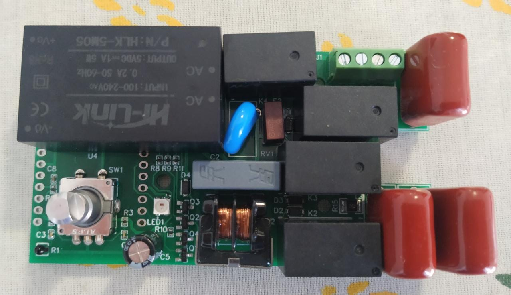

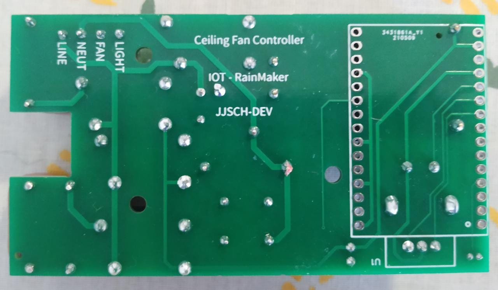

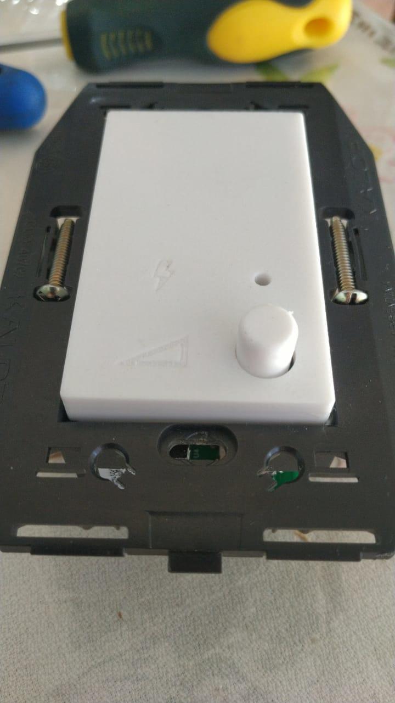

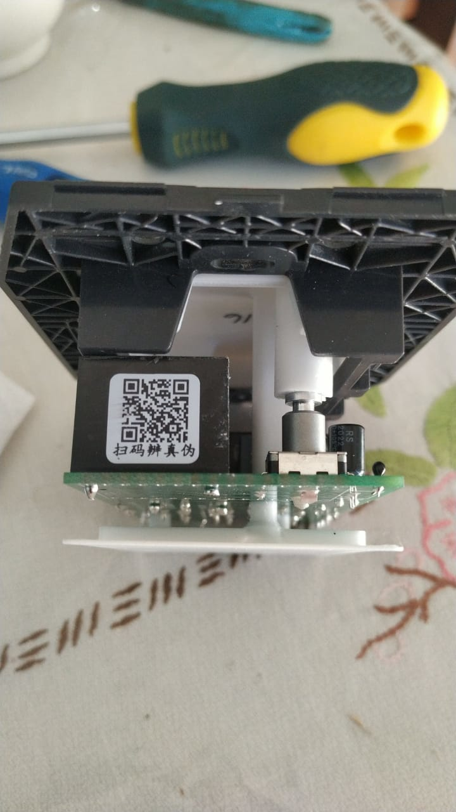

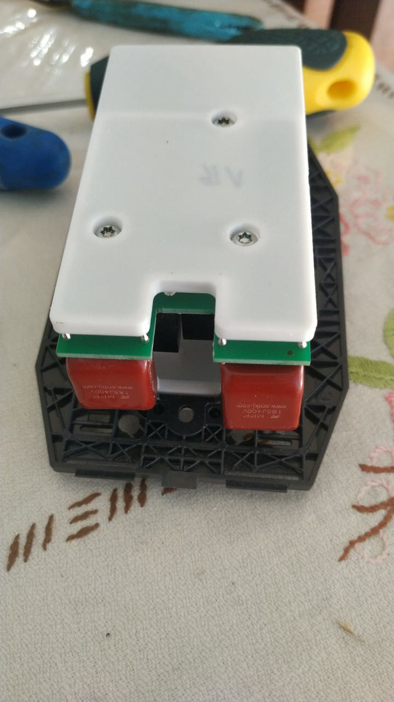

## Electronic for No Humming

To prevent humming, capacitive reactances are used to limit the current in the motor stator, and since the friction (blades etc) is moderately high, the rotation speed decreases. This version has four speeds to keep the form factor as small as possible, (capacitors and relays are large).

## IOT Control

To control the device from a cell phone, [Espressif Rainmaker](https://rainmaker.espressif.com/docs/get-started.html) is used, which has an application for android and iphone, which allows you to configure the Wi-Fi network (provisioning), and control the device through the AWS IOT.

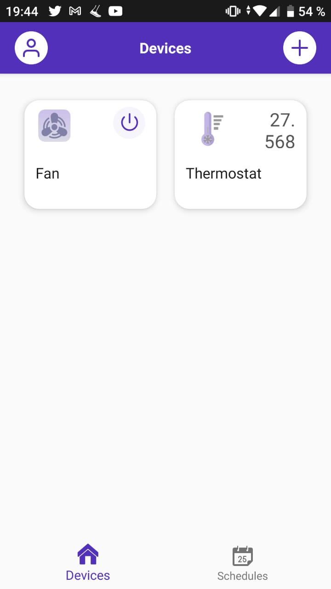

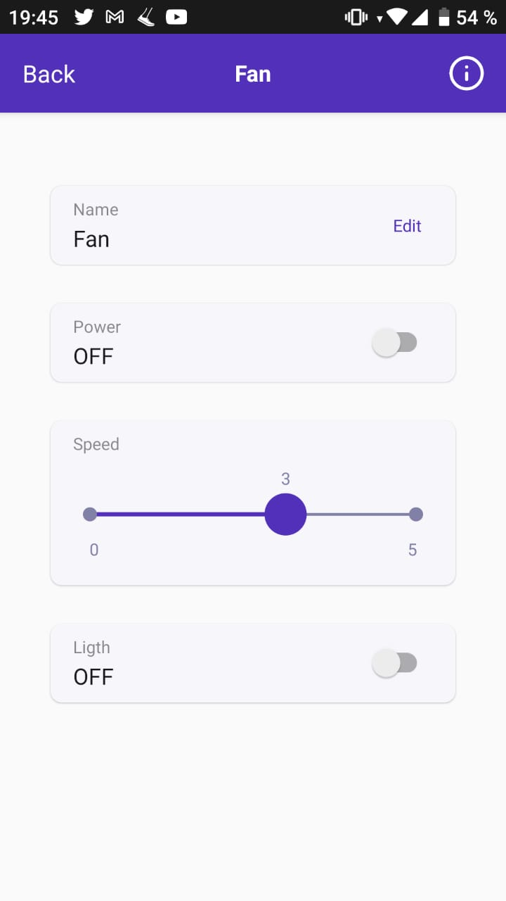

### Manual Control

For local control, a pushbutton rotary encoder is used to set the speed and turn the fan light on/off. To improve the speed resolution, the user has to rotate the shaft three or more steps to increase/decrease.

### Visual indication

Taking advantage of the fact that the ESP32-C3 mini board has a neopixel, the combinations of functions are indicated with colors and brightness levels. For example, when the light is off, the fan speed is indicated with 4 levels of brightness in red, but when it is on in green, and when the fan is off it turns blue to the maximum.

### Thermostat Device

Controls the (ON / OFF) of the fan with temperature. As a sensor it uses a thermistor of 100K at 25 degrees Celsius with a beta of 4250 from Murata model NXRT15WF104FA1B040. The firmware uses the simplified [Steinhart equation](https://en.wikipedia.org/wiki/Steinhart%E2%80%93Hart_equation) to linearize the response. The control implements a 2 degree hysterisis to improve system stability.

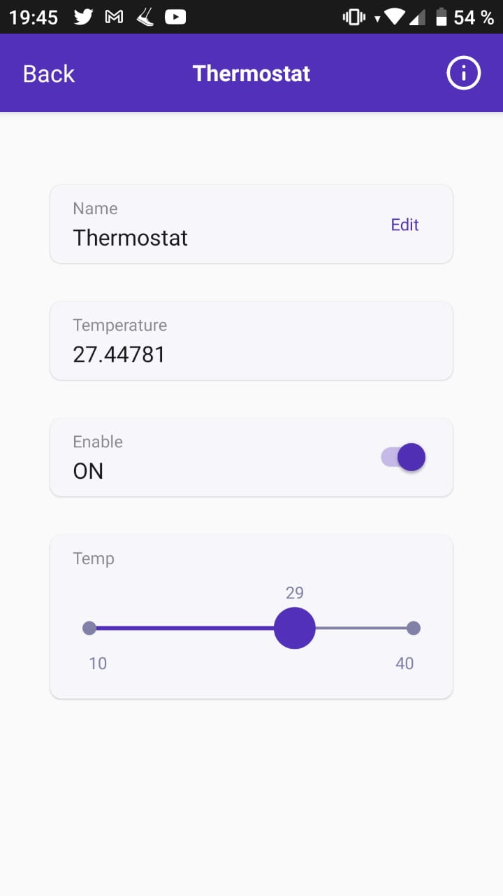

### Power Supply
To power the electronic equipment, approximately 350 mA at 3.3V is required for the CPU when Wi-Fi is in active mode, and 90 mA at 5V for each relay. (350mA * 3.3V) = 1,155 W + (90 mA * 5 * 3 relays) = 1,350 W, total = 2,505 W. To increase the safety factor for the proof of concept select the Hi-Link source [HLK-5M05](https://datasheet.lcsc.com/szlcsc/1912111437_HI-LINK-HLK-5M05_C209907.pdf) that delivers 5V at 1A which is twice the estimated power.

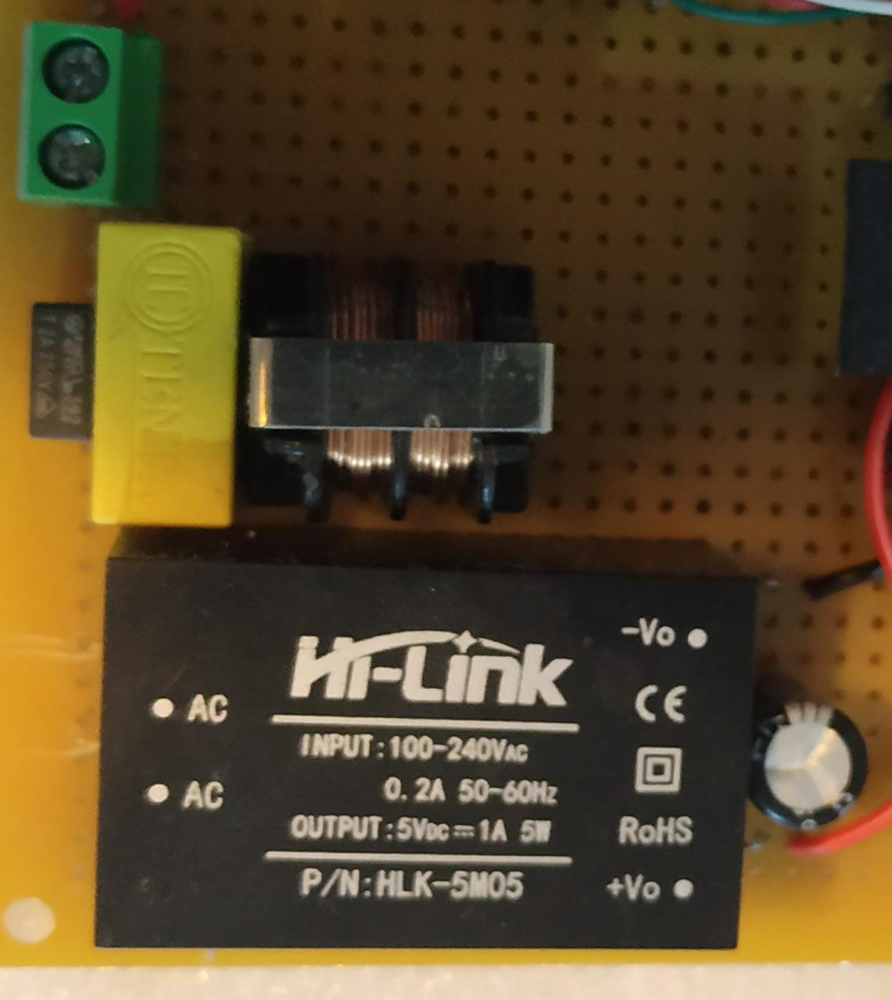

On page 7 of the datasheet, there is a table of suggestions for additional components such as a fuse to protect the circuit from damage when the module malfunctions, a capacitor for filtering and safety protection (EMC certified), and a filter / inductor in common. mode, for EMI filtering. And the last thing was adding a filter capacitor that can reduce the output ripple from the original 50mV to 30mV.

The next two images show the DC output and ripple output of the power supply without load.

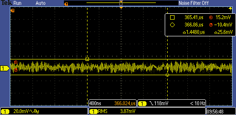

The next two pictures show the DC output and ripple output of the power supply with the CPU running.

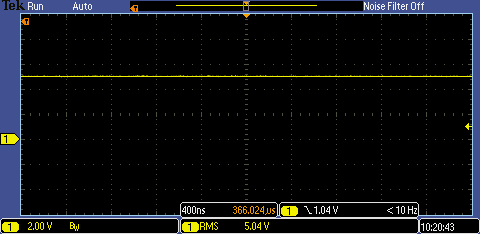

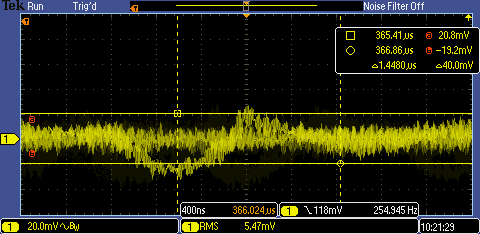

### Reset to Factory

Press and hold the encoder button for more than 3 seconds to reset the board to factory defaults. You will have to provision the board again to use it.

### Schematic
The schematic of the ESP32-C3 version is simple, it consists of an output stage made up of 4 relays, an encoder for manual control, and a thermistor to control the thermostat. As a power supply it uses a 5V 600 mA HLK.

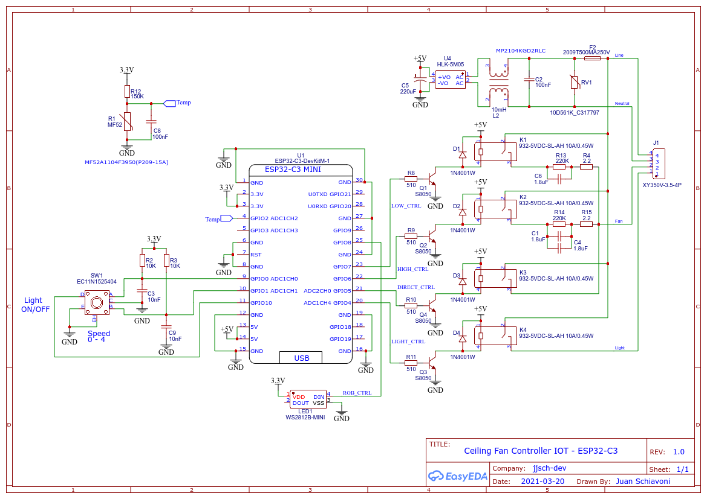

### Prototype Board
The first version of the prototype is a mix of Arduino boards with conventional electronics. The next version will add a power supply to test the concept on a fan.

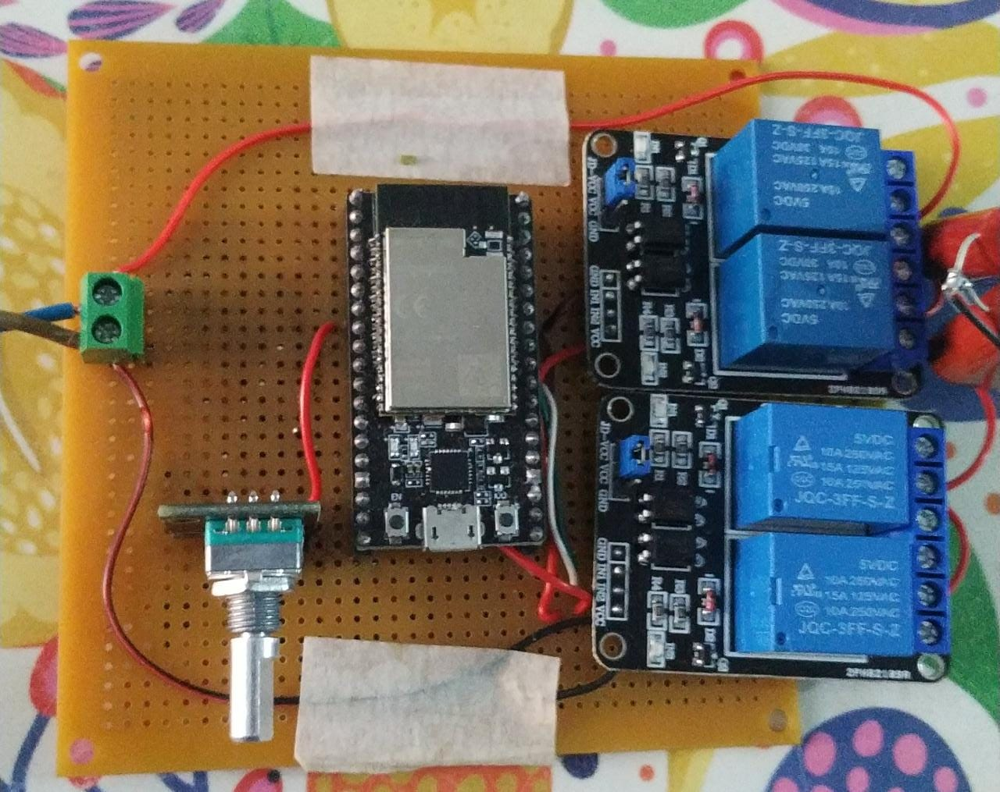

The second version has the thermistor to control the fan thermostat.

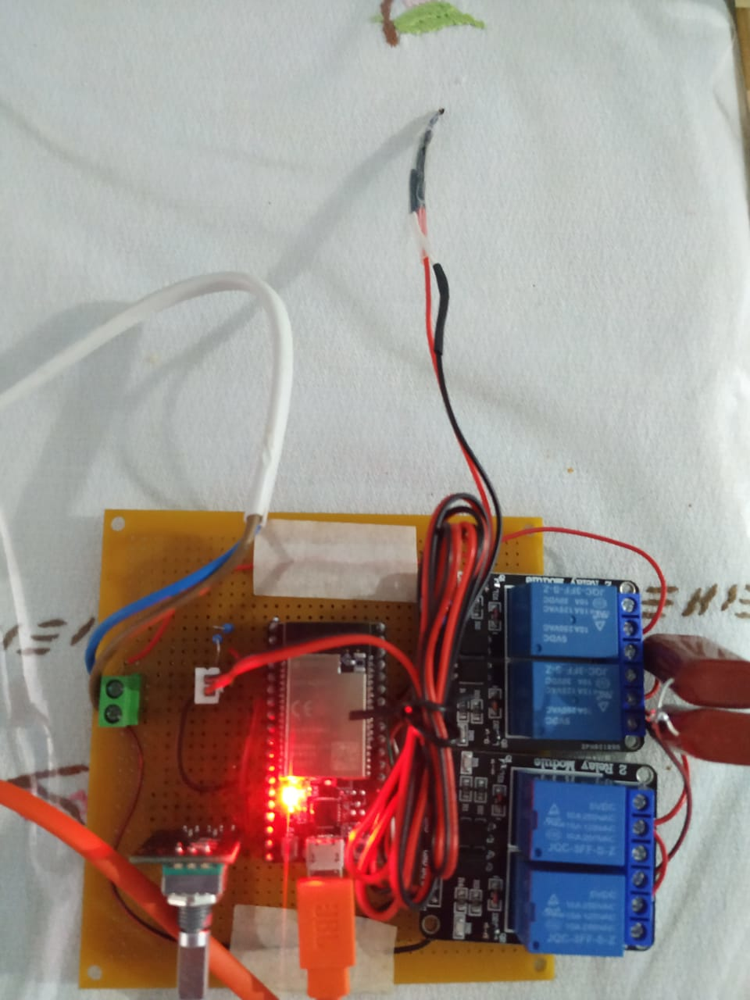

The third prototype is already functional and, although the form factor is not suitable for a wall mount, it allows to control the fan with all the specified functionalities. As you can see, it uses the ESP32-C3 version of the CPU.

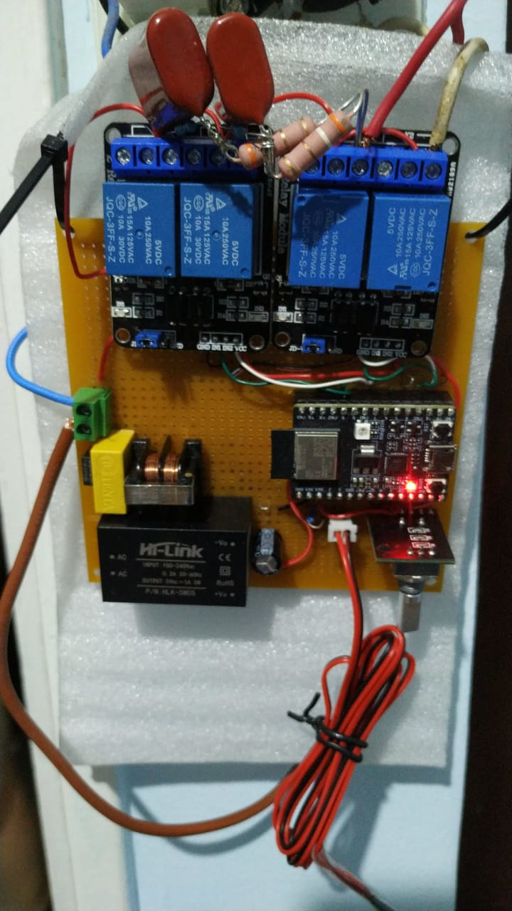

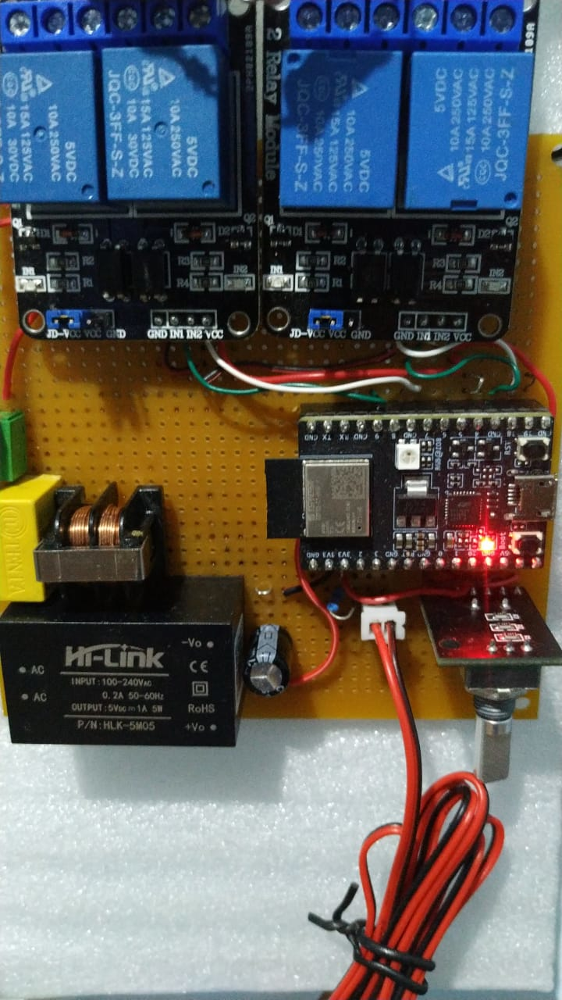

### Development environment
The application is written in C, based on Espressif IDF and as a development tool the [Visual Code](https://docs.espressif.com/projects/esp-idf/en/latest/esp32/get-started/vscode-setup.html) of MS was used with the Espressif plugin.

1 - Download the [IDF](https://docs.espressif.com/projects/esp-idf/en/latest/esp32/get-started/).

2 - Download the [Rainmaker](https://github.com/espressif/esp-rainmaker).

3 - Download the [celing-fan-iot](https://github.com/jjsch-dev/ceiling-fan-iot) application code.

4 - Select the device target CPU for ESP32-C3.
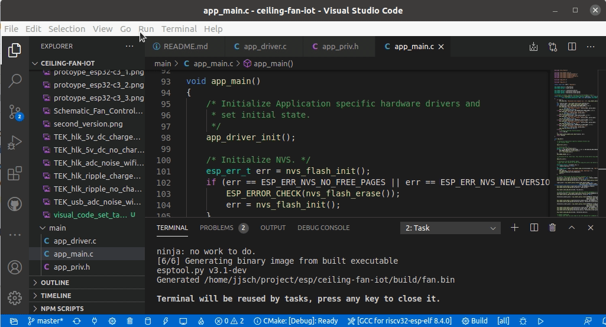

5 - Build (compile and link).
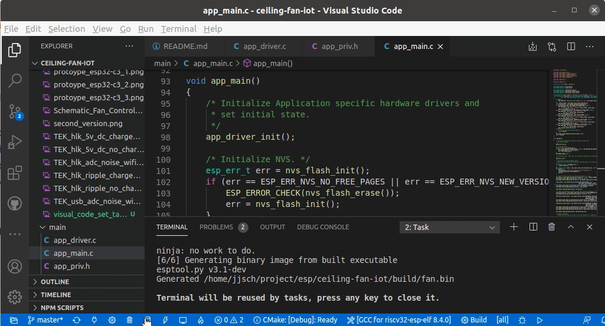

5 - Flash the code.
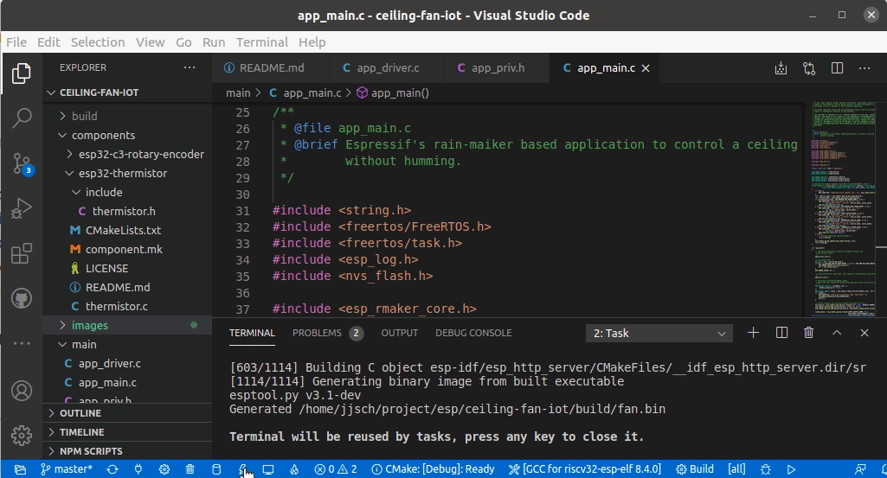

6 - Run the serial monitor.
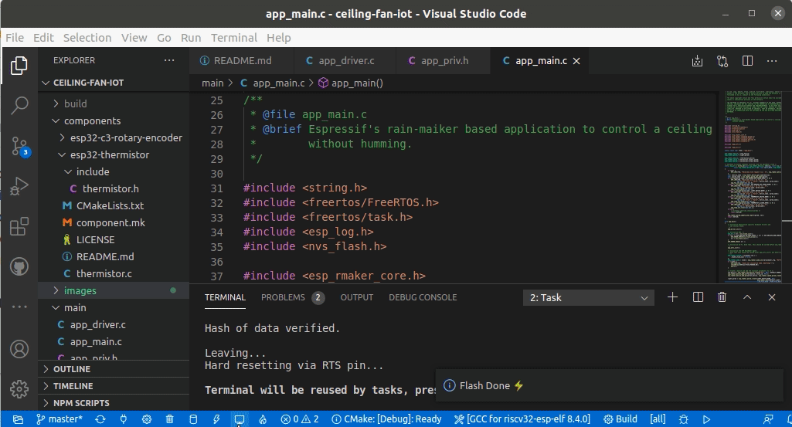

7 - Download the Rain-Maker application for Android or iPhone.

8 - Provisioning (Configure and connect to the Wi-Fi network) Click to play in Youtube.

9 - Enjoy. Click to play in Youtube

