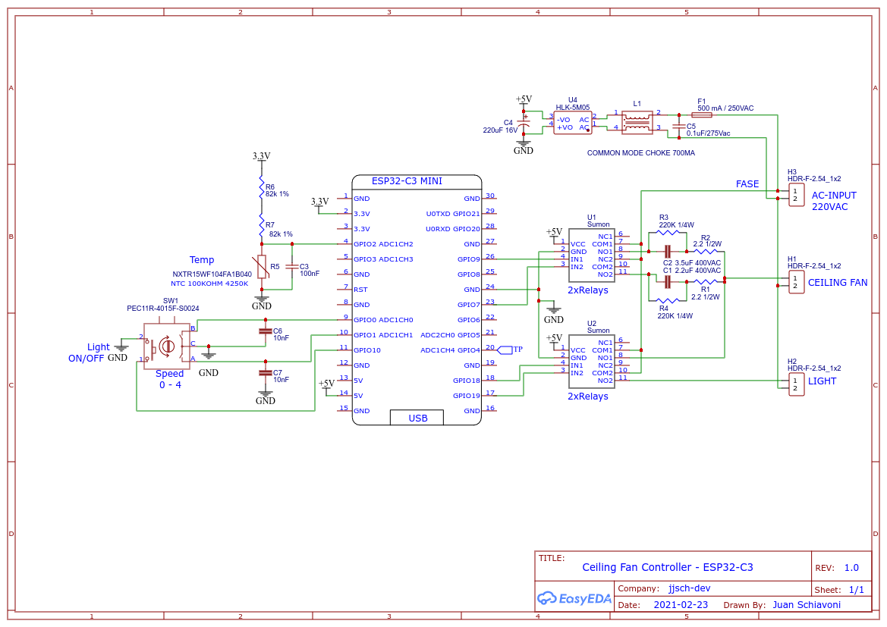

# Ceiling Fan Control - (No Humming)

The purpose of this project is to develop a hum-free electronic ceiling fan device that can be controlled remotely (IOT) or locally with a rotary encoder.

## Electronic for No Humming

To prevent humming, capacitive reactances are used to limit the current in the motor stator, and since the friction (blades etc) is moderately high, the rotation speed decreases. This version has four speeds to keep the form factor as small as possible, (capacitors and relays are large).

## IOT Control

To control the device from a cell phone, [Espressif Rainmaker](https://rainmaker.espressif.com/docs/get-started.html) is used, which has an application for android and iphone, which allows you to configure the Wi-Fi network (provisioning), and control the device through the AWS IOT.

### Manual Control

For local control, a pushbutton rotary encoder is used to set the speed and turn the fan light on / off.

### Thermostat Device

Controls the (ON / OFF) of the fan with temperature. As a sensor it uses a thermistor of 100K at 25 degrees Celsius with a beta of 4250 from Murata model NXRT15WF104FA1B040. The firmware uses the simplified [Steinhart equation](https://en.wikipedia.org/wiki/Steinhart%E2%80%93Hart_equation) to linearize the response. The control implements a 2 degree hysterisis to improve system stability.

### Reset to Factory

Press and hold the encoder button for more than 3 seconds to reset the board to factory defaults. You will have to provision the board again to use it.

### Schematic

### Prototype Board
The first version of the prototype is a mix of Arduino boards with conventional electronics. The next version will add a power supply to test the concept on a fan.

The second version has the thermistor to control the fan thermostat.

